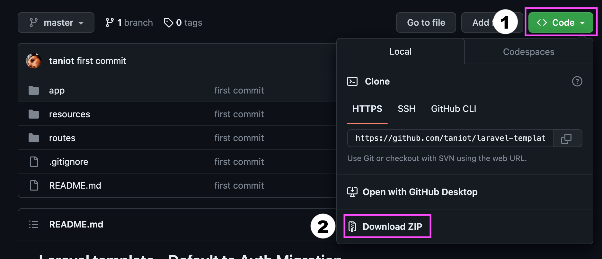

## Laravel template - Default to Auth Migration

Questa è una guida di migrazione dal template [Laravel Template](https://github.com/taniot/laravel-template) al template [Laravel Auth Template](https://github.com/taniot/laravel-auth-template) per integrare il sistema di autenticazione di Laravel in un progetto esistente.

### 🗂 Fase 0 - Download di questa repo

Scarica questa cartella sul tuo computer



e 🤐 unzippa. Da questa cartella prenderemo i files che ci servono per utilizzare le funzionalità di autenticazione nostro progetto.

### 🏁 Fase 1 - Installazione e configurazione progetto da migrare

- Apriamo in VSCode il progetto che vogliamo aggiornare.
- Creiamo un nuovo branch di sviluppo e spostiamoci sul nuovo branch

```bash
git branch feat/auth-features
git checkout feat/auth-features
```

- Iniziamo l'installazione

```bash
composer install
npm install
cp .env.example .env 
php artisan key:generate
# a questo punto, configurare la connessione con db mysql
# proseguire con la migration
php artisan migrate
```

- Lanciamo i Seeder - *se presenti*

```bash
php artisan db:seed --class=SEEDERNAME
```

### 🎒 Fase 2 - Backup dei file di progetto

Rinomina la resources/views (nel tuo progetto)

```bash
mv resources/views resources/views.bk
```

Rinomina il file routes/web.php (nel tuo progetto)
```bash
mv routes/web.php routes/web.bk.php
```

### 🔐 Fase 3 - Copia dei files di autenticazione
Copia - *dai files scaricati in Fase 0* - le seguenti cartelle e files nel vostro progetto. **Attenzione**: non sovrascrivete le tue cartelle o files.

#### Controllers di autenticazione

- *app/Http/Controllers/Auth » /app/Http/Controllers*
- *app/Http/Controllers/ProfileController.php » /app/Http/Controllers*


#### Form Requests di autenticazione

- *app/Http/Requests/Auth » app/Http/Requests*
- *app/Http/Requests/ProfileUpdateRequest.php » app/Http/Requests*

#### Views

- *resources/views » resources/*

#### Routes

- routes/auth.php -> routes/
- routes/web.php -> routes/

### 🔃 Fase 4 - Modifica del Route Service Provider

Modifica nel file
- *app/Providers/RouteServiceProvider.php*

La variable HOME 
```
public const HOME = '/home’;
```
diventa
```
public const HOME = ‘/dashboard';
```
### 🤯 Fase 5 - Refactoring

Avvia il progetto
- Terminale 1
```bash
php artisan serve
```
- Terminale 2
```bash
npm run dev
```

💪 Ripristina il funzionamento dell'applicazione.
